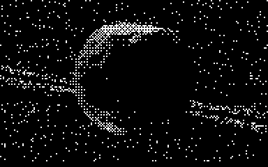
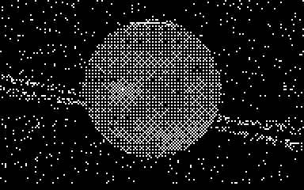
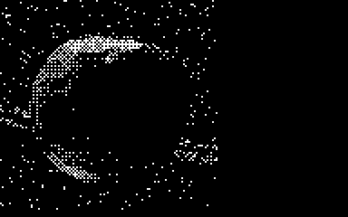
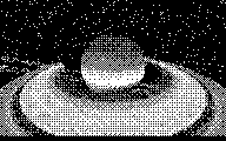

# globe

Render a globe in your terminal. Run it as a screensaver, drive it with the
mouse or keyboard, or print a still frame from your own code.

[](LICENSE)
[](https://crates.io/crates/globe-cli)
[](https://docs.rs/globe)



```
globe -s -c2 -n
```

## Demos

Every clip is a real recording of the binary on a pty, decoded from braille
dots to pixels: no screenshots, no mockups. All five are 1-bit and take under
500 KB together — the previous single drag recording was six times that on its
own.

**Earth, screensaver, night side, braille** — `globe -s -c2 -n`


**Switching bodies** — `globe -s -c2 -t mars` and friends



**The three alphabets** — braille, half blocks, ascii


**Interactive mode** — arrow keys and a mouse drag — `globe -i`



**Saturn's rings** — the globe shading the rings and the rings shading the
bands — `globe -s -c2 -t saturn -z 2.4`



## Features

- **Ten bodies**: the sun, all eight planets and the moon, switchable with
  `-t`, each with its own baked surface map. Saturn has rings.
- **Three alphabets**: braille (default, a 2x4 dot grid per cell), half blocks
  and the original one-glyph-per-cell ascii look.
- **Resolution that follows your font**: each cell carries up to eight
  independent surface samples, so a small terminal font renders a sharper
  globe instead of a coarser one.
- **Night side**: `-n` blends earth's city lights into the dark hemisphere.
- **Cheap frames**: only changed cells are written, batched into runs, in one
  write per frame.
- **Small and quiet**: ~5 MB resident regardless of terminal size, and the
  earth render costs around 1-3% of one core.

## Install

With Rust installed ([rustup.rs](https://rustup.rs)):

```bash
cargo install globe-cli
```

From a clone of this repository:

```bash
cargo build --release
./target/release/globe -s
```

The binary is self-contained: every texture is baked into it, so there is
nothing to download or configure at runtime.

### AUR

`globe` is packaged on the [AUR](https://aur.archlinux.org/packages?K=globe-cli):

```bash
yay -S globe-cli
```

### Docker

```bash
docker build -t globe .
docker run -it --rm globe -s
```

## Usage

`globe -h` lists everything. The mode flags pick what the program does:

| flag | mode |
| --- | --- |
| `-s` | screensaver: orbits the globe, any key exits |
| `-i` | interactive: mouse and keyboard control |
| `-p` | listing: read coordinates from stdin, walk through them |

```bash
globe -s                            # earth, orbiting, in braille
globe -s -t mars -g10               # mars spinning on its axis
globe -s -t saturn                  # saturn with its rings
globe -i -t jupiter                 # drive jupiter yourself
echo "0,0.5;0.1,0.5;0.3,0.5" | globe -p    # visit a list of coordinates
```

### Interactive control

In `-i` mode the mouse and these keys drive the camera:

| key | action |
| --- | --- |
| arrows, `h` `j` `k` `l` | pan and tilt |
| mouse drag | pan and tilt |
| scroll, `PgUp` / `PgDn` | zoom |
| `+` / `-` | globe rotation speed |
| `,` / `.` | camera rotation speed |
| `n` | toggle the night side |
| `Enter` | recenter on the starting coordinates |
| any other key | quit |

In `-s` mode the arrow keys add spin and tilt on top of the orbit.

### Alphabets

`-G` picks how much each character cell carries:

| value | samples per cell | looks like |
| --- | --- | --- |
| `braille` | 2x4 (default) | dot grid, sharpest, best with a very small font |
| `half` | 1x2 | upper/lower half blocks |
| `ascii` | 1x1 | one palette glyph per cell, the original look |

```bash
globe -s -G ascii      # classic ascii art globe
globe -s -G half       # half blocks
```

The same view of mars in each alphabet, straight out of the renderer:

```
globe -s -t mars -G ascii -z 1.25
          .;;,,w,,,,ww,,,,,wwwwwwww,wwwiwwwwwww,,,'',''','w';.
  .      .;',,,,w,,,,,,w,www,ww,,,,,w,,,,,wiiw,',,,,,,',;;''';.
         :;,,'',,',,'',,,,,,,,,,,,,www,www,iw,',,,,;,,,,:;:;,':
        .;,':;,,',,,'',,''''',,,,,,,,,w,ww,w,',,,',,,,,,,''',,;.
       .:';;;,,;',ww,,,wwwiww,w',,,,''''ww,'',,,''',',','',w'';:  .
.... . .;';,,',oooooiiiooiiww,,',,,,,,,,,,,,''''''''w,,',wwww,;;.
  ..   .;;;,,,iioogooooooooiwiw,'',,,,',,,,,''''',,,,,,w,w,,ww,:.
 .     .;,,',iwioooggOggooooiww,',,,,''''','','','w','',,ww,,,,:.
       .:''',,iiiooooooggooii,,,,,,,,,,','',',,',',''',,,iwww,;;.
        :',,',wiiiiooooiiiww,,,,,,,,,,,','',,,''''',',',wiw,,w':.
    .   .:,,,',wwiiiiiwwiiww,'',,,,,,,,,''''',,,'',',,www,w,w,;: .     .
        .:',,'',,wwwiwwwww,,,',',,,,',,,''',,,'',,,''w,wwwwiww;.. ..   .
         .;;,,,,',,',,,,,,,,'',,,,,,,'',,:,''',,,,,,,,wwwwww';.  ..
          .:;,,,'''','''''''',,,,,,,,:',,'',ww',,,,,,,,,www,;.      .  .
```

```
globe -s -t mars -G half -z 1.25
          ▀   ▀ ▀ ▀ ▀ ▀ ▀ ▀ ▀ ▀▄▀ ▀ ▀ ▀▄▀ ▀ ▀ ▀ ▀ ▀ ▀ ▀ ▀ ▀     ▀
    ▄ ▀     ▀▄▀ ▀▄▀ ▀▄▀ ▀▄▀ ▀▄▀ ▀▄▀ ▀▄▀ ▀ ▀▄▀▄▀ ▀▄▀ ▀ ▀ ▀ ▀
 ▀          ▀ ▀ ▀ ▀ ▀ ▀ ▀ ▀ ▀ ▀ ▀ ▀ ▀ ▀ ▀ ▀▄▀ ▀ ▀ ▀ ▀ ▀   ▀ ▀       ▀
    ▀  ▄  ▀ ▀ ▀ ▀ ▀ ▀▄▀ ▀ ▀ ▀▄▀ ▀ ▀ ▀▄▀ ▀▄▀ ▀▄▀ ▀ ▀ ▀▄▀ ▀ ▀ ▀
          ▀   ▀ ▀ ▀▄▀ ▀▄▀ ▀▄▀ ▀ ▀ ▀ ▀ ▀ ▀ ▀ ▀ ▀ ▀ ▀ ▀ ▀   ▀ ▀
 ▀ ▄     ▄▀ ▀▄▀▄▀▄▀▄▀▄▀▄▀▄▀▄▀▄▀ ▀ ▀ ▀ ▀ ▀ ▀ ▀▄▀ ▀▄▀ ▀▄▀ ▀▄▀ ▀▄     ▄
 ▄     ▀  ▀ ▀ ▀▄▀▄▀▄▀ ▀▄▀▄▀▄▀ ▀ ▀ ▀ ▀ ▀ ▀ ▀ ▀ ▀ ▀ ▀ ▀ ▀▄▀ ▀ ▀ ▀  ▄
     █▀▀▀ ▀ ▀▄▀▄▀▄▀▄▀█▀▄▀▄▀▄▀▄▀ ▀ ▀ ▀▄▀ ▀ ▀ ▀▄▀ ▀ ▀ ▀ ▀ ▀▄▀ ▀▄▀
          ▀ ▀ ▀▄▀ ▀▄▀▄▀▄▀▄▀▄▀ ▀ ▀ ▀ ▀ ▀   ▀ ▀ ▀   ▀ ▀ ▀▄▀ ▀ ▀ ▀   ▀▀
          ▀ ▀▄▀ ▀▄▀▄▀▄▀ ▀▄▀ ▀▄▀ ▀▄▀ ▀▄▀ ▀ ▀ ▀▄▀ ▀ ▀ ▀▄▀ ▀▄▀ ▀▄
  ▄       ▀ ▀ ▀▄▀ ▀▄▀ ▀▄▀ ▀ ▀ ▀ ▀ ▀ ▀ ▀ ▀ ▀ ▀ ▀ ▀ ▀ ▀ ▀ ▀ ▀▄▀     ▀
            ▀ ▀ ▀▄▀ ▀▄▀ ▀▄▀ ▀▄▀ ▀ ▀ ▀▄▀ ▀ ▀ ▀▄▀ ▀ ▀ ▀▄▀ ▀▄▀ ▀  ▀ ▀ ▄ ▀▀
            ▀ ▀   ▀ ▀ ▀ ▀ ▀ ▀ ▀ ▀ ▀   ▀ ▀ ▀ ▀ ▀   ▀ ▀ ▀▄▀ ▀ ▀
            ▀ ▀ ▀ ▀ ▀▄▀ ▀▄▀ ▀ ▀ ▀▄▀ ▀   ▀▄▀ ▀▄▀ ▀▄▀ ▀▄▀ ▀▄▀       ▀ ▀█
```

```
globe -s -t mars -G braille -z 1.25
⠀⠀⠀⠀⠀⠀⠀⠀⠀⠀⠰⠀⠀⠅⠕⠅⠕⠅⠕⠅⠕⠅⠕⠅⠅⠅⠕⠅⠕⠅⠕⢅⠕⠅⠕⠅⠕⠅⠕⢅⠕⠅⠕⠕⠕⠅⠕⠅⠅⠅⠕⠅⠅⠅⠕⠅⠁⠅⠕⢴⠀⠀⠀⠀⠐⠀⠀⠀⠀⠀⠀⠀
⠁⠀⠀⠀⠀⠀⠀⠈⠀⠄⠀⠀⠕⠅⠕⠅⠕⠅⠕⠅⠕⠅⠕⠅⠕⢕⠕⢅⠕⠅⠕⠅⠕⠅⠕⢅⠕⢅⠕⠅⠅⠅⠕⢅⠕⠅⠕⠅⠕⠅⠕⠅⠑⠅⠕⠅⠅⠅⠅⠅⠄⠀⠈⠀⠀⠀⠀⠁⠀⠀⠀⠀
⠀⠀⠀⠀⠀⠀⠀⠀⠀⠈⡀⠅⠅⠅⠕⠅⠁⠅⠕⠅⠁⠅⠕⠅⠅⠅⠕⠅⠕⠅⠅⠅⠕⠅⠕⢅⠕⠅⠕⠅⠕⠅⠕⢅⠅⠅⠅⠅⠅⠅⠕⠅⠅⠅⠕⠅⠁⠀⠁⠅⠅⠀⠀⠁⠀⠀⠀⠀⠀⠀⠀⠀
⠀⠀⠀⠀⠁⠀⠀⠀⢀⠀⠄⠅⠁⠅⠑⠅⠕⠅⠅⠅⠅⠅⠕⠅⠅⢅⠅⠅⠅⠅⠕⠅⠕⠅⠅⠅⠕⠅⠕⠅⠕⢅⠕⠅⠕⠅⠕⠅⠕⠅⠕⠅⠅⠅⠕⠅⠅⠅⠕⢅⠅⠅⠀⠀⠁⠐⠁⠀⠀⠀⠀⠀
⠀⢄⠀⠁⠀⠀⠀⠀⠀⠀⠅⠅⠁⠄⠅⢅⠁⢅⠕⢅⠅⢅⠕⢅⠕⢅⠕⠅⠅⠅⠕⠅⠁⠅⠅⠅⠁⠅⠅⢅⠅⠅⠅⠅⠅⠅⠕⠅⠅⠅⠕⠅⠁⠅⠅⠅⠁⠅⠕⢅⠅⠅⠀⠐⠁⠀⢀⠀⠀⠀⠀⠀
⠁⠅⠔⢔⠄⢅⠀⠄⠔⠀⠅⠅⠕⠅⠕⢕⢕⢕⠕⢅⠕⢕⠕⢕⠕⢅⠕⢅⠕⢅⠅⠅⠅⠅⠕⠅⠕⠅⠕⠅⠕⠅⠕⠅⠅⠅⠅⠅⠕⠅⠅⠅⠕⠅⠅⠅⠕⢅⠕⠅⠕⠅⠅⠈⢀⠀⠀⠀⠄⠀⠀⠀
⢄⢄⠀⠈⠁⠀⠐⠈⠁⠁⠁⠅⠅⠅⠕⢕⠕⢕⢕⢕⢕⢕⢕⢕⠕⢕⢕⢕⠕⠅⠕⠅⠅⠅⠕⠅⠅⠅⠅⠅⠁⠅⠕⠅⠁⠅⠅⠅⠅⠅⠕⠅⠁⠅⠕⢅⠅⢅⠕⠅⠅⠅⠅⠀⠀⠀⢀⠀⢀⢀⠀⠐
⠁⠀⠑⠕⠀⠄⠑⢅⠀⠄⠕⠅⠕⢅⠕⢅⢕⢕⠕⢕⢝⢕⢕⢕⢝⢕⠕⢅⠕⢅⠕⠅⠅⠅⠕⠅⠕⠅⠅⠅⠕⠅⠅⠅⠕⠅⠅⠅⠅⠅⠕⠅⠕⠅⠅⢅⢕⢅⠕⠅⠕⠅⠅⠐⠀⠀⠀⠀⠀⠀⠀⢀
⠀⠀⠀⠁⠀⠀⠀⠀⠀⠀⠅⠅⠅⠅⠕⢕⠕⢕⠕⢕⠕⢕⢝⢕⠕⢕⢕⢕⠕⠅⠕⠅⠅⠅⠕⠅⠅⠅⠕⠅⠁⠅⠅⠅⠅⠅⠕⠅⠁⠅⠕⠅⠅⠅⠅⢅⠕⠅⠕⢅⠅⠅⠅⠐⠀⠀⠀⠀⠀⠀⠀⠀
⠀⠄⠀⠀⠀⠀⠁⠀⠀⠀⠕⠅⠕⢅⠕⢕⠕⢕⠕⢕⠕⢕⠕⢕⠕⢕⠕⠅⠕⠅⠅⠅⠕⠅⠕⠅⠕⠅⠕⠅⠅⠅⠅⠅⠕⠅⠅⠅⠅⠅⠅⠅⠕⠅⠕⢅⠕⢅⠕⠅⠕⢅⠁⠀⠀⠀⠀⠀⠀⠀⠀⠀
⠀⠀⠀⠠⠁⠈⠀⠀⠀⠀⠑⠅⠅⠅⠕⠕⠕⠅⠕⢕⠕⠅⠕⢕⠕⠅⠕⠅⠅⠅⠅⠅⠅⠅⠕⠅⠅⠅⠕⠅⠁⠅⠅⠅⠁⠅⠕⠅⠁⠅⠕⠅⠁⠅⠕⢅⠕⠅⠕⢅⠕⠅⠀⠀⠀⠀⠀⠀⠀⠄⠀⠀
⠀⠐⠀⠅⠀⠀⠀⠀⠀⠀⠀⠅⠕⠅⠅⠅⠕⠅⠕⢅⠕⢅⠕⢅⠕⠅⠕⠅⠕⠅⠅⠅⠕⠅⠕⠅⠅⠅⠅⠅⠅⠅⠅⠅⠕⠅⠅⠅⠕⠅⠕⠅⠕⠅⠕⢅⠕⢅⠕⢅⠕⠉⠑⠀⠐⠤⠅⠁⢁⢕⢕⠠
⠀⠀⠀⠀⠄⠀⠀⠀⠀⠀⠀⠀⠅⠅⠕⠅⠅⠅⠕⠅⠁⠅⠕⠅⠕⠅⠕⠅⠅⠅⠕⠅⠅⠅⠕⠅⠅⠄⠅⠅⠁⠅⠕⠅⠅⠅⠅⠅⠁⠅⠅⠅⠁⠅⠕⠅⠕⠅⠕⢅⠁⠅⠄⠤⠁⢀⠄⠄⠀⠀⢀⠁
⠀⠀⠀⠈⠀⢀⠀⠀⠢⠀⠐⠄⠁⠅⠅⠅⠕⠅⠅⠅⠅⠅⠅⠅⠅⠅⠅⠅⠅⠅⠅⠅⠕⠅⠕⠅⠕⠅⠁⢅⠅⠅⠕⠅⠕⠅⠕⠅⠕⠅⠅⠅⠕⠅⠕⢅⠕⢅⠕⠁⠁⠁⠀⠀⠀⠄⠀⠄⠈⠡⠕⠱
```

Braille carries the most work per cell: eight samples, about four times the
cpu of the single-glyph render, at roughly half the cost per sample. `-G half`
and `-G ascii` are progressively cheaper, and `-G ascii` is lighter than the
single-glyph renderer this project started from.

### Bodies

`-t` selects what to render:

| body | map | notes |
| --- | --- | --- |
| `earth` (default) | 1024x512 day + night | city lights on the dark side with `-n` |
| `sun` | 1024x512 | always lit: no night map, so no terminator |
| `mercury` | 1024x512 | cratered grey rock |
| `venus` | 1024x512 | radar surface view |
| `moon` | 1024x512 | maria and craters |
| `mars` | 1024x512 | deserts and dark albedo features |
| `jupiter` | 1024x512 | belts, zones and the great red spot |
| `saturn` | 1024x512 + ring profile | ringed; the rings shade the globe and the globe shades the rings |
| `uranus` | 1024x512 | faint banding |
| `neptune` | 1024x512 | bands and the dark spot |

Earth is the only body with a night side, so `-n` only changes earth. A body
without a night map has no terminator, which is why the sun renders fully lit.

Saturn's rings are drawn as a flat annulus in the planet's equatorial plane,
sampled from a radial brightness/opacity profile. The renderer intersects the
ring plane per sample, so the rings occlude the globe, the globe occludes the
rings, the planet casts a shadow across the rings and the rings cast a shadow
across the bands. Tilt and radii live in `tools/bodies/saturn.json`.

### Custom textures

`--texture` and `--texture-night` load your own ascii maps on top of the
template. A custom day map replaces the template's maps entirely.

```bash
globe -s --texture ./my-map.txt
globe -s -t earth --texture ./day.txt --texture-night ./night.txt
```

## Use the library

```toml
[dependencies]
globe = "0.3.0"
```

```rust
use globe::{CameraConfig, Canvas, GlobeConfig, GlobeTemplate};

let mut globe = GlobeConfig::new()
    .use_template(GlobeTemplate::Saturn)
    .with_camera(CameraConfig::default())
    .build();

// the canvas is sized in character cells, one glyph per cell
let mut canvas = Canvas::new(120, 60, None);
globe.render_on(&mut canvas);

for y in 0..canvas.get_size().1 {
    let row: String = canvas.row(y).iter().collect();
    println!("{}", row);
}
```

Rendering is deterministic: given the same canvas, camera and alphabet, you
get the same glyphs. See `globe/examples/` for runnable programs.

## Textures

The pipeline has three layers:

- `tools/bodies/<name>.json` describes each body: source image, luminance
  mode, gamma, optional percentile contrast stretch and output level window,
  plus the ring profile for Saturn.
- `tools/bake_textures.py` downloads missing sources into the gitignored
  `tools/sources/`, quantizes them with Floyd-Steinberg dithering and writes
  `globe/textures/<name>_hd.gidx`, a compact palette-index format that the
  library includes at compile time.

```bash
python3 tools/bake_textures.py --list          # what is available
python3 tools/bake_textures.py --body mars --fetch
python3 tools/bake_textures.py --all           # rebake every body
```

- `globe/textures/*.gidx` is what ships: 11 maps, 5.6 MB total, at 1024x512
  palette indices. The two earth source JPEGs are committed because they are
  not on the CDN; every other source is fetched on demand into the gitignored
  `tools/sources/`. Rebaking is reproducible, and adding a body is a JSON file
  plus a `GlobeTemplate` variant (see [CONTRIBUTING.md](CONTRIBUTING.md)).

Imagery comes from [Solar System Scope](https://www.solarsystemscope.com/textures/)
under [CC BY 4.0](https://creativecommons.org/licenses/by/4.0/).

## Performance

Measured with the screensaver, output drained, at two terminal sizes (peak
RSS is `VmHWM` over the whole run, earth's map, one core):

| grid | alphabet | samples per cell | cpu | peak RSS |
| --- | --- | --- | --- | --- |
| 300x90 | ascii | 1 | 1.2% | 4.7 MB |
| 300x90 | half | 2 | 2.6% | 4.7 MB |
| 300x90 | braille | 8 | 8.0% | 4.9 MB |
| 500x150 | ascii | 1 | 3.0% | 5.0 MB |
| 500x150 | half | 2 | 6.1% | 5.1 MB |
| 500x150 | braille | 8 | 19.2% | 5.3 MB |

Cost tracks samples per cell, not terminal size: braille is eight times the
work of ascii for eight times the resolution, and the same ascii render used
to cost 1.8% and 17.5 MB before the cell-resolution canvas and the baked
palette-index maps. Saturn's ring intersection adds about 14% over a ringless
body at the same size, and no measurable memory.

## How it works

One ray per sub-cell sample. The ray grid is folded once per frame into a
separable basis (`dir = vx * gx + vy * gy + v0`), so a sample costs a handful
of multiplies; the sphere test uses a scaled discriminant, which keeps every
sign exact without normalising the ray; and lighting needs no second square
root because the sun is effectively at infinity. Sub-cell samples are
ordered-dithered with a Bayer 8x8 matrix into whatever glyph the alphabet
wants: 1x1 palette glyphs for `ascii`, 1x2 half blocks, 2x4 braille dots. The
three alphabets therefore carry 1, 2 and 8 samples per cell, which is what
makes a very small terminal font render a sharper globe rather than a
coarser one.

Textures are baked ahead of time into palette indices and `include_bytes!`d,
so startup parses nothing and a texel fetch is one indexed load. Saturn's
rings are a radial `(brightness, opacity)` profile ray traced against the
ring plane, which is also why the planet can shade the rings and the rings
can shade the bands. `docs/internals.md` walks through the math, the file
formats and the cost model in detail.

## Keeping it light

- The eleven shipped maps are 1024x512 palette indices, 5.6 MB total, baked
  into the 7 MB binary. Nothing is downloaded or parsed at runtime.
- Resident memory is about 4.6 MB in ascii, 4.9 MB in braille, at any
  terminal size: the canvas, one glyph per cell, is the only per-frame state.
- Only changed cells are written, batched into runs, one write and one flush
  per frame.
- Want it lighter still? `-G half` or `-G ascii` cut the sample count, and
  `python3 tools/bake_textures.py --all --cols 720 --rows 360` rebuilds
  smaller maps if you want to trade texels for bytes.

## Development

```bash
cargo build --release
cargo test --workspace
cargo fmt --all --check
cargo clippy --workspace --all-targets -- -D warnings
```

CI runs exactly those four gates on Linux, macOS and Windows. The library has
no dependencies; the CLI only pulls `crossterm` and `clap`.

## Contributing

Bug reports, bodies, alphabets and performance work are all welcome. Read
[CONTRIBUTING.md](CONTRIBUTING.md) for the development setup, how to add a
body end to end, and the commit conventions. By submitting a pull request you
agree to license your contribution under GPL-3.0.

## Changelog

See [CHANGELOG.md](CHANGELOG.md) for release history.

## License

[GPL-3.0](LICENSE). This is a fork of
[adamsky/globe](https://github.com/adamsky/globe), which is where the original
renderer, the interactive mode and the ascii look come from.

## Credits

- Rendering math based on [C++ code by DinoZ1729](https://github.com/DinoZ1729/Earth).
- Sun, planet and moon imagery from
  [Solar System Scope](https://www.solarsystemscope.com/textures/), CC BY 4.0,
  baked into palette index maps by `tools/bake_textures.py`.
