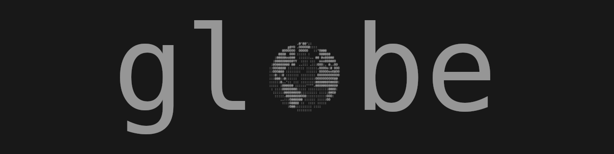
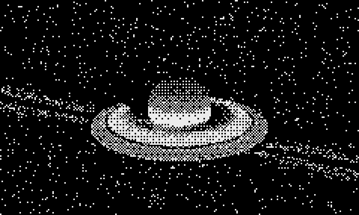

# globe

Render a globe in your terminal. Run it as a screensaver, drive it with the
mouse or keyboard, or print a still frame from your own code.

[](LICENSE)
[](https://crates.io/crates/globe-cli)
[](https://docs.rs/globe)



```
globe -s -c2 -n
```

## Features

- **Ten bodies**: the sun, all eight planets and the moon, switchable with
  `-t`, each with its own baked surface map. Saturn has rings.
- **Three alphabets**: braille (default, a 2x4 dot grid per cell), half blocks
  and the original one-glyph-per-cell ascii look.
- **Resolution that follows your font**: each cell carries up to eight
  independent surface samples, so a small terminal font renders a sharper
  globe instead of a coarser one.
- **Night side**: `-n` blends earth's city lights into the dark hemisphere.
- **Cheap frames**: only changed cells are written, batched into runs, in one
  write per frame.
- **Small and quiet**: ~5 MB resident regardless of terminal size, and the
  earth render costs around 1-3% of one core.

## Install

With Rust installed ([rustup.rs](https://rustup.rs)):

```bash
cargo install globe-cli
```

From a clone of this repository:

```bash
cargo build --release
./target/release/globe -s
```

The binary is self-contained: every texture is baked into it, so there is
nothing to download or configure at runtime.

### AUR

`globe` is packaged on the [AUR](https://aur.archlinux.org/packages?K=globe-cli):

```bash
yay -S globe-cli
```

### Docker

```bash
docker build -t globe .
docker run -it --rm globe -s
```

## Usage

`globe -h` lists everything. The mode flags pick what the program does:

| flag | mode |
| --- | --- |
| `-s` | screensaver: orbits the globe, any key exits |
| `-i` | interactive: mouse and keyboard control |
| `-p` | listing: read coordinates from stdin, walk through them |

```bash
globe -s                            # earth, orbiting, in braille
globe -s -t mars -g10               # mars spinning on its axis
globe -s -t saturn                  # saturn with its rings
globe -i -t jupiter                 # drive jupiter yourself
echo "0,0.5;0.1,0.5;0.3,0.5" | globe -p    # visit a list of coordinates
```


### Interactive control

In `-i` mode the mouse and these keys drive the camera:

| key | action |
| --- | --- |
| arrows, `h` `j` `k` `l` | pan and tilt |
| mouse drag | pan and tilt |
| scroll, `PgUp` / `PgDn` | zoom |
| `+` / `-` | globe rotation speed |
| `,` / `.` | camera rotation speed |
| `n` | toggle the night side |
| `Enter` | recenter on the starting coordinates |
| any other key | quit |

In `-s` mode the arrow keys add spin and tilt on top of the orbit.

### Alphabets

`-G` picks how much each character cell carries:

| value | samples per cell | looks like |
| --- | --- | --- |
| `braille` | 2x4 (default) | dot grid, sharpest, best with a very small font |
| `half` | 1x2 | upper/lower half blocks |
| `ascii` | 1x1 | one palette glyph per cell, the original look |

```bash
globe -s -G ascii      # classic ascii art globe
globe -s -G half       # half blocks
```

Braille carries the most work per cell: eight samples, about four times the
cpu of the single-glyph render, at roughly half the cost per sample. `-G half`
and `-G ascii` are progressively cheaper, and `-G ascii` is lighter than the
single-glyph renderer this project started from.

### Bodies

`-t` selects what to render:

| body | map | notes |
| --- | --- | --- |
| `earth` (default) | 1440x720 day + night | city lights on the dark side with `-n` |
| `sun` | 1440x720 | always lit: no night map, so no terminator |
| `mercury` | 1440x720 | cratered grey rock |
| `venus` | 1440x720 | radar surface view |
| `moon` | 1440x720 | maria and craters |
| `mars` | 1440x720 | deserts and dark albedo features |
| `jupiter` | 1440x720 | belts, zones and the great red spot |
| `saturn` | 1440x720 + ring profile | ringed; the rings shade the globe and the globe shades the rings |
| `uranus` | 1440x720 | faint banding |
| `neptune` | 1440x720 | bands and the dark spot |

Earth is the only body with a night side, so `-n` only changes earth. A body
without a night map has no terminator, which is why the sun renders fully lit.

Saturn's rings are drawn as a flat annulus in the planet's equatorial plane,
sampled from a radial brightness/opacity profile. The renderer intersects the
ring plane per sample, so the rings occlude the globe, the globe occludes the
rings, the planet casts a shadow across the rings and the rings cast a shadow
across the bands. Tilt and radii live in `tools/bodies/saturn.json`.

### Custom textures

`--texture` and `--texture-night` load your own ascii maps on top of the
template. A custom day map replaces the template's maps entirely.

```bash
globe -s --texture ./my-map.txt
globe -s -t earth --texture ./day.txt --texture-night ./night.txt
```

## Use the library

```toml
[dependencies]
globe = "0.3.0"
```

```rust
use globe::{CameraConfig, Canvas, GlobeConfig, GlobeTemplate};

let mut globe = GlobeConfig::new()
    .use_template(GlobeTemplate::Saturn)
    .with_camera(CameraConfig::default())
    .build();

// the canvas is sized in character cells, one glyph per cell
let mut canvas = Canvas::new(120, 60, None);
globe.render_on(&mut canvas);

for y in 0..canvas.get_size().1 {
    let row: String = canvas.row(y).iter().collect();
    println!("{}", row);
}
```

Rendering is deterministic: given the same canvas, camera and alphabet, you
get the same glyphs. See `globe/examples/` for runnable programs.

## Textures

The pipeline has three layers:

- `tools/bodies/<name>.json` describes each body: source image, luminance
  mode, gamma, optional percentile contrast stretch and output level window,
  plus the ring profile for Saturn.
- `tools/bake_textures.py` downloads missing sources into the gitignored
  `tools/sources/`, quantizes them with Floyd-Steinberg dithering and writes
  `globe/textures/<name>_hd.gidx`, a compact palette-index format that the
  library includes at compile time.

```bash
python3 tools/bake_textures.py --list          # what is available
python3 tools/bake_textures.py --body mars --fetch
python3 tools/bake_textures.py --all           # rebake every body
```

- `globe/textures/*.gidx` is what ships. Rebaking is byte-reproducible, and
  adding a body is a JSON file plus a `GlobeTemplate` variant (see
  [CONTRIBUTING.md](CONTRIBUTING.md)).

Imagery comes from [Solar System Scope](https://www.solarsystemscope.com/textures/)
under [CC BY 4.0](https://creativecommons.org/licenses/by/4.0/).

## Performance

Measured with the screensaver, output drained, at two terminal sizes (peak
RSS is `VmHWM` of the whole run):

| grid | alphabet | cpu (one core) | peak RSS |
| --- | --- | --- | --- |
| 300x90 | ascii | 1.3% | 4.9 MB |
| 300x90 | half | 2.7% | 4.9 MB |
| 300x90 | braille | 8.0% | 5.0 MB |
| 500x150 | ascii | 3.0% | 5.3 MB |
| 500x150 | braille | 18.4% | 5.6 MB |

The same ascii render used to cost 1.8% and 17.5 MB before the cell-resolution
canvas and the baked palette-index textures; braille is the cost of eight
samples per cell, not a regression. Saturn's ring intersection adds about 14%
over a ringless body at the same size.

## Development

```bash
cargo build --release
cargo test --workspace
cargo fmt --all --check
cargo clippy --workspace --all-targets -- -D warnings
```

CI runs exactly those four gates on Linux, macOS and Windows. The library has
no dependencies; the CLI only pulls `crossterm` and `clap`.

## Contributing

Bug reports, bodies, alphabets and performance work are all welcome. Read
[CONTRIBUTING.md](CONTRIBUTING.md) for the development setup, how to add a
body end to end, and the commit conventions. By submitting a pull request you
agree to license your contribution under GPL-3.0.

## Changelog

See [CHANGELOG.md](CHANGELOG.md) for release history.

## License

[GPL-3.0](LICENSE). This is a fork of
[adamsky/globe](https://github.com/adamsky/globe), which is where the original
renderer, the interactive mode and the ascii look come from.

## Credits

- Rendering math based on [C++ code by DinoZ1729](https://github.com/DinoZ1729/Earth).
- Sun, planet and moon imagery from
  [Solar System Scope](https://www.solarsystemscope.com/textures/), CC BY 4.0,
  baked into palette index maps by `tools/bake_textures.py`.
